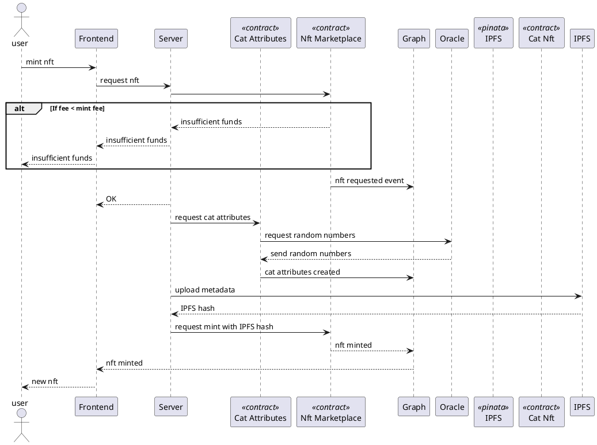

```plantuml
@startuml
actor user
participant Frontend as frontend
participant "Server" as server
participant "Cat Attributes" as cat_attributes <<contract>>
participant "Nft Marketplace" as nft_marketplace <<contract>>
participant "Graph" as graph
participant "Oracle" as oracle
participant "IPFS" as ipfs <<pinata>>
participant "Cat Nft" as cat_nft <<contract>>

user -> frontend : mint nft
frontend -> server : request nft
server -> nft_marketplace

alt If fee < mint fee
    nft_marketplace --> server : insufficient funds
    server --> frontend : insufficient funds
    frontend --> user : insufficient funds
end

nft_marketplace -> graph : nft requested event
server --> frontend : OK

server -> cat_attributes : request cat attributes
cat_attributes -> oracle : request random numbers

oracle --> cat_attributes : send random numbers
cat_attributes -> graph : cat attributes created

server -> IPFS : upload metadata
IPFS --> server : IPFS hash

' No error handling here for now
server -> nft_marketplace : request mint with IPFS hash
nft_marketplace --> graph : nft minted

graph --> frontend : nft minted
frontend --> user : new nft


@enduml
```
