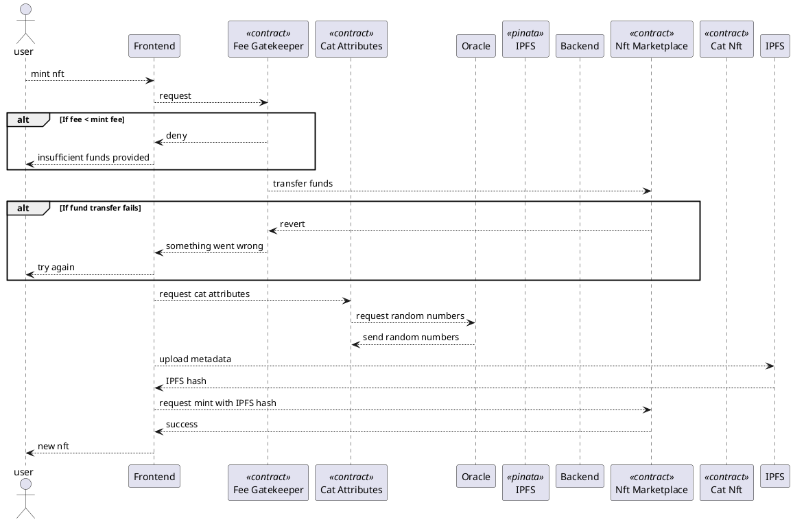

```plantuml
@startuml
actor user
participant Frontend as frontend
participant "Fee Gatekeeper" as fee_gatekeeper <<contract>>
participant "Cat Attributes" as cat_attributes <<contract>>
participant "Oracle" as oracle
participant "IPFS" as ipfs <<pinata>>
participant "Backend" as backend
participant "Nft Marketplace" as nft_marketplace <<contract>>
participant "Cat Nft" as cat_nft <<contract>>

user --> frontend : mint nft
frontend --> fee_gatekeeper : request

alt If fee < mint fee
    fee_gatekeeper --> frontend : deny
    frontend --> user : insufficient funds provided
end

fee_gatekeeper --> nft_marketplace : transfer funds

alt If fund transfer fails
    nft_marketplace --> fee_gatekeeper : revert
    fee_gatekeeper --> frontend : something went wrong
    frontend --> user : try again
end

frontend --> cat_attributes : request cat attributes
cat_attributes --> oracle : request random numbers
oracle --> cat_attributes : send random numbers

frontend --> IPFS : upload metadata
IPFS --> frontend : IPFS hash

' No error handling here for now
frontend --> nft_marketplace : request mint with IPFS hash
nft_marketplace --> frontend : success
frontend --> user : new nft


@enduml
```
